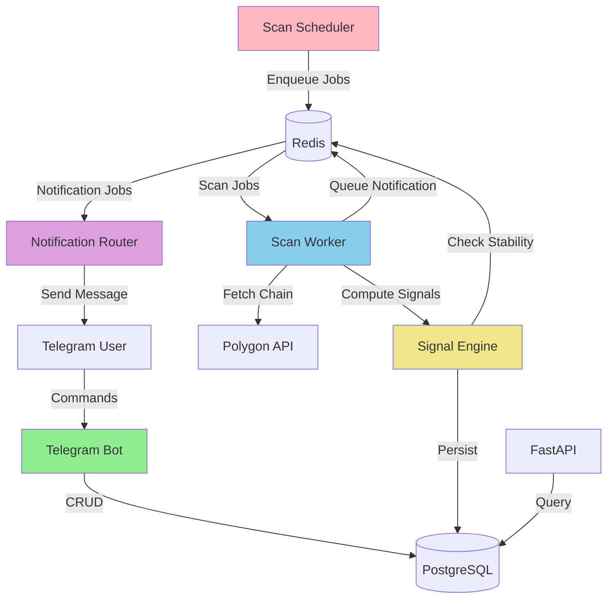

# Forward Factor Signal Bot

A multi-user Telegram bot that detects Forward Factor calendar spread opportunities in options markets. The bot scans option chains for dislocations where front-month implied volatility is elevated relative to the implied forward volatility, signaling potential calendar spread trades.

## Overview

The Forward Factor (FF) measures how expensive front IV is relative to implied forward IV:

```
V1 = σ1² * T1
V2 = σ2² * T2
V_fwd = (V2 - V1) / (T2 - T1)
σ_fwd = sqrt(V_fwd)
FF = (σ1 - σ_fwd) / σ_fwd
```

When FF >= threshold (typically 20%), the bot sends a Telegram notification with actionable trade details.

## Features

- Multi-user support with individual watchlists
- Real-time option chain scanning via Polygon.io API
- Tiered scanning cadence (high/medium/low priority)
- Configurable Forward Factor thresholds and DTE pairs
- Liquidity and data quality filters
- Signal stability tracking (debouncing)
- Quiet hours and timezone support (default: America/Vancouver)
- Trade decision tracking (Place/Ignore)
- No automated trading - all signals for manual execution

## Architecture



**Components:**
- **Telegram Bot**: User interface and command handling
- **FastAPI Backend**: Analytics and monitoring endpoints
- **Scan Scheduler**: Tiered job scheduling (APScheduler)
- **Scan Workers**: Fetch chains and compute signals
- **Notification Router**: Fan-out to subscribed users
- **PostgreSQL**: Persistent storage
- **Redis**: Caching and state management

## Prerequisites

- Docker and Docker Compose
- Telegram Bot Token (from @BotFather)
- Polygon.io API Key

## Quick Start

1. Clone the repository:
```bash
git clone <repository-url>
cd ff-telegram-bot
```

2. Create environment file:
```bash
cp .env.example .env
```

3. Edit `.env` and set your credentials:
```bash
TELEGRAM_BOT_TOKEN=your_bot_token_here
POLYGON_API_KEY=your_polygon_api_key_here
```

4. Start all services:
```bash
docker-compose up -d
```

5. Run database migrations:
```bash
docker-compose exec api alembic upgrade head
```

6. Verify services are running:
```bash
docker-compose ps
```

All services should show "Up" status:
- postgres (port 5432)
- redis (port 6379)
- api (port 8000)
- bot (Telegram polling)
- scheduler (job scheduling)
- worker (scan processing)

## Usage

### Telegram Bot Commands

Open Telegram and search for your bot, then:

```
/start - Initialize your account
/add TICKER - Add ticker to watchlist (e.g., /add SPY)
/remove TICKER - Remove ticker from watchlist
/list - Show your watchlist
/history - View recent signals and decisions
/help - Show help message
```

### Signal Notifications

When a Forward Factor signal is detected, you'll receive a Telegram message with:

- Ticker symbol
- Forward Factor value
- Front and back IV
- Expiry dates and DTEs
- Underlying price
- Trade structure (calendar spread)

Each notification includes two buttons:
- Place Trade: Records that you executed the trade
- Ignore: Records that you skipped the signal

### API Endpoints

The FastAPI backend provides monitoring endpoints:

```bash
# Health check
curl http://localhost:8000/health

# Get recent signals
curl http://localhost:8000/signals

# Get signals for specific ticker
curl http://localhost:8000/signals?ticker=SPY&limit=10
```

## Configuration

### Environment Variables

Key configuration options in `.env`:

```bash
# Scan Cadence (minutes)
SCAN_CADENCE_HIGH=3      # High priority tickers
SCAN_CADENCE_MEDIUM=15   # Medium priority tickers
SCAN_CADENCE_LOW=60      # Low priority tickers

# Default Settings
DEFAULT_FF_THRESHOLD=0.20           # 20% minimum FF
DEFAULT_SIGMA_FWD_FLOOR=0.05        # 5% minimum forward vol
DEFAULT_MIN_OPEN_INTEREST=100       # Minimum OI per leg
DEFAULT_MIN_VOLUME=10               # Minimum volume per leg
DEFAULT_MAX_BID_ASK_PCT=0.08        # 8% max bid-ask spread
DEFAULT_STABILITY_SCANS=2           # Consecutive scans required
DEFAULT_COOLDOWN_MINUTES=120        # 2 hour cooldown between alerts
DEFAULT_TIMEZONE=America/Vancouver  # User timezone
```

### User Settings

Default DTE pairs (can be customized per user in future):
- 30 vs 60 days
- 30 vs 90 days
- 60 vs 90 days

Default vol point: ATM (at-the-money)

## Development

### Project Structure

```
ff-telegram-bot/
├── app/
│   ├── api/              # FastAPI backend
│   ├── bot/              # Telegram bot handlers
│   ├── core/             # Config, database, redis
│   ├── models/           # SQLAlchemy models
│   ├── providers/        # External API adapters
│   ├── scheduler/        # Scan scheduler
│   ├── services/         # Business logic
│   ├── utils/            # Utilities
│   └── workers/          # Scan workers and router
├── alembic/              # Database migrations
├── tests/                # Unit tests
├── docker-compose.yml    # Service orchestration
├── Dockerfile            # Application image
└── requirements.txt      # Python dependencies
```

### Running Tests

```bash
# Run all tests
docker-compose exec worker pytest

# Run specific test file
docker-compose exec worker pytest tests/test_signal_engine.py -v

# Run with coverage
docker-compose exec worker pytest --cov=app tests/
```

### Database Migrations

```bash
# Create a new migration
docker-compose exec api alembic revision --autogenerate -m "description"

# Apply migrations
docker-compose exec api alembic upgrade head

# Rollback one migration
docker-compose exec api alembic downgrade -1
```

### Logs

```bash
# View all logs
docker-compose logs -f

# View specific service logs
docker-compose logs -f bot
docker-compose logs -f worker
docker-compose logs -f scheduler
```

## Monitoring

### Check Service Health

```bash
# API health
curl http://localhost:8000/health

# Database connection
docker-compose exec postgres psql -U ffbot -d ffbot -c "SELECT COUNT(*) FROM users;"

# Redis connection
docker-compose exec redis redis-cli ping
```

### View Database

```bash
# Connect to database
docker-compose exec postgres psql -U ffbot -d ffbot

# Useful queries
SELECT COUNT(*) FROM users;
SELECT COUNT(*) FROM subscriptions;
SELECT COUNT(*) FROM signals;
SELECT ticker, COUNT(*) FROM signals GROUP BY ticker ORDER BY COUNT(*) DESC LIMIT 10;
```

## Troubleshooting

### Bot not responding

1. Check bot service is running: `docker-compose ps bot`
2. Check bot logs: `docker-compose logs bot`
3. Verify TELEGRAM_BOT_TOKEN is correct in `.env`

### No signals being generated

1. Check scheduler is running: `docker-compose logs scheduler`
2. Check worker is processing: `docker-compose logs worker`
3. Verify POLYGON_API_KEY is correct and has quota
4. Check if tickers are in watchlist: `/list` command
5. Verify scan tier assignment: Check `master_tickers` table

### Database connection errors

1. Ensure postgres is healthy: `docker-compose ps postgres`
2. Run migrations: `docker-compose exec api alembic upgrade head`
3. Check DATABASE_URL in `.env`

## Production Deployment

For production deployment:

1. Use strong database passwords
2. Enable SSL for database connections
3. Set up proper logging and monitoring
4. Configure backup strategy for PostgreSQL
5. Use environment-specific `.env` files
6. Consider horizontal scaling of worker service
7. Set up alerts for API rate limits

## License

See LICENSE file for details.

## Support

For issues and questions, please open an issue on the repository.